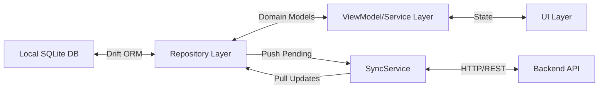
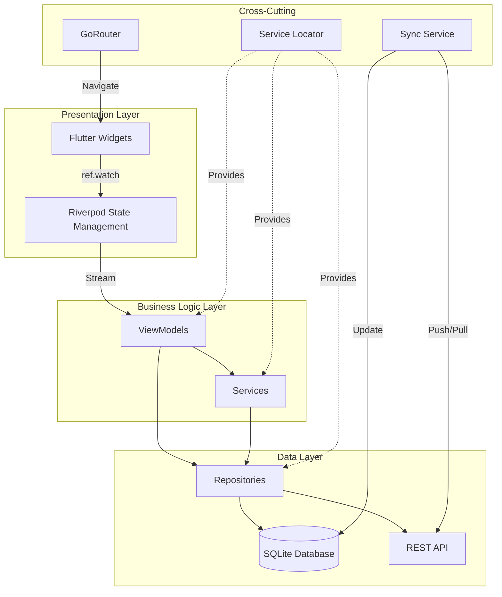

# Design Patterns in AeroPOS Codebase

## Executive Summary

The AeroPOS codebase implements a **layered architecture** combining multiple design patterns to create a scalable, maintainable Point-of-Sale (POS) system. The primary architectural pattern is **MVVM (Model-View-ViewModel)** with **Repository Pattern**, enhanced by **Service Locator** for dependency injection, **State Management** using Riverpod, and **Offline-First Architecture** with bidirectional sync capabilities.

---

## Core Architectural Patterns

### 1. MVVM (Model-View-ViewModel) Pattern

**Purpose**: Separates business logic from UI, enabling testability and maintainability.

**Implementation**:
- **Model**: Domain entities ([Product](file:///home/dell/flutter_app/ezo/lib/core/models/product.dart), Category, Unit, Brand, etc.)
- **View**: Flutter widgets (Screens in [features](file:///home/dell/flutter_app/ezo/lib/features))
- **ViewModel**: Business logic layer ([ProductViewModel](file:///home/dell/flutter_app/ezo/lib/core/viewModel/product_view_model.dart), CategoryViewModel, etc.)

**Example from ProductViewModel**:

```dart
class ProductViewModel {
  final AppDatabase _database;
  final CategoryRepository _categoryRepository;
  final UnitRepository _unitRepository;
  final BrandRepository _brandRepository;
  final SyncService _syncService;

  // Expose reactive streams to UI
  Stream<List<ProductEntity>> get allProducts => _database.watchAllProducts();
  Stream<List<TypedResult>> get allProductsWithCategory => 
      _database.watchProductsWithCategory();

  // Business logic methods
  Future<void> addProduct({
    required String name,
    required double price,
    // ... other parameters
  }) async {
    final entry = ProductsCompanion(
      uuid: Value(_uuid.v4()),
      name: Value(name),
      // ... mapping logic
    );
    await _database.insertProduct(entry);
  }
}
```

**Benefits**:
- Clear separation of concerns
- UI reacts automatically to data changes via streams
- Business logic is testable independently of UI
- Multiple views can share the same ViewModel

---

### 2. Repository Pattern

**Purpose**: Abstracts data access logic, providing a clean API for data operations regardless of the data source.

**Implementation**: 

The codebase uses a [BaseRepository](file:///home/dell/flutter_app/ezo/lib/core/repositories/base_repository.dart) abstract class with concrete implementations for each entity.

```dart
abstract class BaseRepository<T, E extends DataClass, C extends UpdateCompanion<E>> {
  final AppDatabase db;
  final TableInfo<Table, E> table;

  // Convert between database entities and domain models
  T toDomain(E entity);
  C toCompanion(T domain);

  // Common CRUD operations
  Future<int> insert(T domain);
  Future<bool> updateRecord(T domain);
  Future<int> softDelete(String uuid);
}
```

**Concrete Example - [ProductRepository](file:///home/dell/flutter_app/ezo/lib/core/repositories/product_repository.dart)**:

```dart
class ProductRepository {
  final AppDatabase db;

  Future<List<Product>> getAllProducts() async {
    final entities = await (db.select(db.products)
        ..where((t) => t.isDeleted.equals(false))).get();
    return entities.map(_mapToDomain).toList();
  }

  Future<int> createProduct(Product product) async {
    final companion = _mapToCompanion(product).copyWith(
      syncStatus: Value(SyncStatus.pending.value),
    );
    final id = await db.into(db.products).insert(companion);
    ServiceLocator.instance.syncService.sync(); // Trigger sync
    return id;
  }

  // Mapping between domain and database layers
  Product _mapToDomain(ProductEntity entity) { /* ... */ }
  ProductsCompanion _mapToCompanion(Product product) { /* ... */ }
}
```

**Benefits**:
- Decouples business logic from data persistence
- Easy to swap data sources (local DB, API, cache)
- Centralized data access logic
- Supports offline-first architecture

---

### 3. Service Locator Pattern

**Purpose**: Centralized dependency management and object lifecycle control.

**Implementation**: [ServiceLocator](file:///home/dell/flutter_app/ezo/lib/core/di/service_locator.dart) singleton manages all dependencies.

```dart
class ServiceLocator {
  static final instance = ServiceLocator._();
  ServiceLocator._();

  late final AppDatabase database;
  late final ProductRepository productRepository;
  late final SyncService syncService;
  late final ProductViewModel productViewModel;
  // ... other dependencies

  Future<void> initialize() async {
    // Initialize in dependency order
    database = AppDatabase();
    
    productRepository = ProductRepository(database);
    categoryRepository = CategoryRepository(database);
    
    syncService = SyncService(
      db: database,
      dio: Dio(),
      productRepo: productRepository,
      // ... other repos
    );
    
    productViewModel = ProductViewModel(
      database,
      categoryRepository,
      unitRepository,
      brandRepository,
      syncService,
    );
    
    syncService.startAutoSync(interval: const Duration(minutes: 5));
  }
}
```

**Usage in Application**:

```dart
void main() async {
  WidgetsFlutterBinding.ensureInitialized();
  await ServiceLocator.instance.initialize();
  runApp(const ProviderScope(child: EzoPosApp()));
}
```

**Benefits**:
- Single source of truth for dependencies
- Controlled initialization order
- Easy to access dependencies throughout the app
- Simplified testing with mock injection

---

### 4. State Management Pattern (Riverpod)

**Purpose**: Reactive state management for UI updates and data flow.

**Implementation**: Uses Flutter Riverpod for declarative state management.

**Example - [Cart State Management](file:///home/dell/flutter_app/ezo/lib/features/pos/state/cart_state.dart)**:

```dart
// State Model
class CartState {
  final List<CartItem> items;
  final UserEntity? selectedCustomer;
  final double overallDiscount;
  
  double get subtotal => items.fold(0.0, (sum, item) => sum + item.subtotal);
  double get taxAmount => items.fold(0.0, (sum, item) => sum + item.tax);
  double get total => /* calculation logic */;
}

// State Notifier
class CartNotifier extends StateNotifier<CartState> {
  CartNotifier() : super(const CartState());

  void addProduct(ProductEntity product) {
    // Immutable state updates
    state = state.copyWith(items: [...state.items, newItem]);
  }

  void updateQuantity(ProductEntity product, int quantity) { /* ... */ }
  void clearCart() { state = const CartState(); }
}

// Provider Declaration
final cartProvider = StateNotifierProvider<CartNotifier, CartState>((ref) {
  return CartNotifier();
});

// Stream Provider for reactive data
final posProductListProvider = StreamProvider<List<ProductEntity>>((ref) {
  final query = ref.watch(productSearchProvider).toLowerCase();
  final database = ServiceLocator.instance.database;
  
  return database.select(database.products).watch().map((products) {
    return products.where((p) => /* filter logic */).toList();
  });
});
```

**Usage in UI**:

```dart
class PosScreen extends ConsumerStatefulWidget {
  @override
  ConsumerState<PosScreen> createState() => _PosScreenState();
}

class _PosScreenState extends ConsumerState<PosScreen> {
  @override
  Widget build(BuildContext context) {
    final cartState = ref.watch(cartProvider);
    final productList = ref.watch(posProductListProvider).value ?? [];
    
    return Scaffold(
      body: Column(
        children: [
          Text('Total: Rs ${cartState.total}'),
          // UI automatically rebuilds when state changes
        ],
      ),
    );
  }
}
```

**Benefits**:
- Reactive UI updates
- Compile-time safety
- Automatic dependency tracking
- Easy testing and debugging

---

### 5. Offline-First Architecture with Sync Pattern

**Purpose**: Enable full offline functionality with automatic bidirectional synchronization.

**Implementation**: [SyncService](file:///home/dell/flutter_app/ezo/lib/core/services/sync_service.dart) manages push/pull operations.

**Architecture Flow**:



**Sync Service Implementation**:

```dart
class SyncService {
  final AppDatabase db;
  final Dio dio;
  Timer? _syncTimer;
  bool _isSyncing = false;

  void startAutoSync({Duration interval = const Duration(minutes: 5)}) {
    _syncTimer = Timer.periodic(interval, (_) => sync());
  }

  Future<void> sync() async {
    if (_isSyncing) return;
    _isSyncing = true;
    
    try {
      await push();  // Upload local changes
      await pull();  // Download server updates
    } finally {
      _isSyncing = false;
    }
  }

  Future<void> push() async {
    // Push pending products
    final pendingProducts = await (db.select(db.products)
        ..where((t) => t.syncStatus.equals(1))).get();
    
    for (final prod in pendingProducts) {
      await _pushEntity('/products', {
        'uuid': prod.uuid,
        'name': prod.name,
        // ... other fields
      }, () async {
        await (db.update(db.products)..where((t) => t.id.equals(prod.id)))
            .write(ProductsCompanion(syncStatus: Value(0)));
      });
    }
  }

  Future<void> pull() async {
    final lastSyncTime = await _getLastSyncTime();
    final response = await dio.post('/sync', data: {
      'lastSyncTime': lastSyncTime?.toIso8601String(),
    });
    
    if (response.statusCode == 200) {
      final updates = response.data['updates'];
      await _applyUpdates(updates);
      await _updateLastSyncTime(DateTime.now());
    }
  }
}
```

**Sync Status Tracking**:

Every entity has:
- `syncStatus`: 0 (synced), 1 (pending)
- `isDeleted`: Soft delete flag
- `uuid`: Universal identifier for conflict resolution
- `updatedAt`: Timestamp for incremental sync

**Benefits**:
- Works fully offline
- Automatic conflict resolution
- Incremental sync reduces bandwidth
- Eventual consistency with server

---

### 6. Navigation Pattern (Declarative Routing)

**Purpose**: Type-safe, declarative navigation with deep linking support.

**Implementation**: Uses GoRouter with StatefulShellRoute for persistent navigation state.

**Router Configuration - [app_router.dart](file:///home/dell/flutter_app/ezo/lib/core/router/app_router.dart)**:

```dart
final appRouter = GoRouter(
  initialLocation: '/dashboard',
  routes: [
    StatefulShellRoute.indexedStack(
      builder: (context, state, navigationShell) {
        return AppShell(navigationShell: navigationShell);
      },
      branches: [
        // Index 0: Dashboard
        StatefulShellBranch(
          routes: [
            GoRoute(
              path: '/dashboard',
              builder: (context, state) => const DashboardScreen(),
            ),
          ],
        ),
        // Index 1: Products with nested routes
        StatefulShellBranch(
          routes: [
            GoRoute(
              path: '/inventory',
              builder: (context, state) => const ProductListScreen(),
              routes: [
                GoRoute(
                  path: 'view',
                  builder: (context, state) {
                    final product = state.extra as ProductEntity;
                    return ProductDetailScreen(product: product);
                  },
                ),
              ],
            ),
          ],
        ),
        // ... other branches
      ],
    ),
    // Full-screen route outside shell
    GoRoute(
      path: '/pos',
      builder: (context, state) => const PosScreen(),
    ),
  ],
);
```

**Shell Pattern - [AppShell](file:///home/dell/flutter_app/ezo/lib/core/layout/app_shell.dart)**:

```dart
class AppShell extends StatefulWidget {
  final StatefulNavigationShell navigationShell;

  void _onDestinationSelected(int branchIndex) {
    if (branchIndex == -1) {
      context.push('/pos');
      return;
    }
    widget.navigationShell.goBranch(
      branchIndex,
      initialLocation: branchIndex == widget.navigationShell.currentIndex,
    );
  }

  @override
  Widget build(BuildContext context) {
    return Scaffold(
      appBar: /* ... */,
      body: Row(
        children: [
          NavigationRail(/* ... */),
          Expanded(child: widget.navigationShell),
        ],
      ),
    );
  }
}
```

**Benefits**:
- Persistent navigation state across tabs
- Deep linking support
- Type-safe navigation
- Responsive layout (drawer/rail/bottom nav)

---

### 7. Adapter Pattern (ORM Mapping)

**Purpose**: Convert between different data representations (Database ↔ Domain ↔ API).

**Implementation**: Mapping functions in repositories and services.

```dart
// Database Entity (Drift ORM)
@DataClassName('ProductEntity')
class Products extends Table {
  IntColumn get id => integer().autoIncrement()();
  TextColumn get uuid => text().unique()();
  TextColumn get name => text()();
  RealColumn get price => real()();
  // ... other columns
}

// Domain Model
class Product {
  final int id;
  final String uuid;
  final String name;
  final double price;
  final SyncStatus syncStatus;
  // ... other fields
}

// Repository Mapping
Product _mapToDomain(ProductEntity entity) {
  return Product(
    id: entity.id,
    uuid: entity.uuid,
    name: entity.name,
    price: entity.price,
    syncStatus: SyncStatus.fromValue(entity.syncStatus),
  );
}

ProductsCompanion _mapToCompanion(Product product) {
  return ProductsCompanion(
    id: product.id == 0 ? const Value.absent() : Value(product.id),
    uuid: Value(product.uuid),
    name: Value(product.name),
    price: Value(product.price),
    syncStatus: Value(product.syncStatus.value),
  );
}
```

**Benefits**:
- Clean separation between layers
- Database schema changes don't affect domain logic
- Type safety across boundaries
- Easy to add validation or transformation

---

### 8. Observer Pattern (Reactive Streams)

**Purpose**: Automatic UI updates when data changes.

**Implementation**: Drift's `.watch()` methods return Streams that emit new values on data changes.

```dart
// In Database
Stream<List<ProductEntity>> watchAllProducts() => 
    (select(products)..where((tbl) => tbl.isDeleted.equals(false))).watch();

// In ViewModel
Stream<List<ProductEntity>> get allProducts => _database.watchAllProducts();

// In UI (via Riverpod StreamProvider)
final posProductListProvider = StreamProvider<List<ProductEntity>>((ref) {
  final database = ServiceLocator.instance.database;
  return database.select(database.products).watch();
});

// Widget automatically rebuilds
Widget build(BuildContext context) {
  final productsAsync = ref.watch(posProductListProvider);
  
  return productsAsync.when(
    data: (products) => ListView.builder(/* ... */),
    loading: () => CircularProgressIndicator(),
    error: (err, stack) => Text('Error: $err'),
  );
}
```

**Benefits**:
- Real-time UI updates
- No manual refresh needed
- Efficient - only rebuilds affected widgets
- Works seamlessly with CRUD operations

---

## Common Use Cases

### Use Case 1: Adding a New Product

**Flow**:

1. **UI Layer** ([AddItemScreen](file:///home/dell/flutter_app/ezo/lib/features/inventory/products/add_product_screen.dart)): User fills form
2. **ViewModel** ([ProductViewModel](file:///home/dell/flutter_app/ezo/lib/core/viewModel/product_view_model.dart)): Validates and creates ProductsCompanion
3. **Database** ([AppDatabase](file:///home/dell/flutter_app/ezo/lib/core/database/app_database.dart)): Inserts with `syncStatus = 1` (pending)
4. **Observer**: Stream emits new product list
5. **UI**: Automatically updates product grid
6. **Sync Service**: Detects pending item, pushes to server
7. **Server Response**: Updates `syncStatus = 0` (synced)

```dart
// UI calls ViewModel
await productViewModel.addProduct(
  name: nameController.text,
  price: double.parse(priceController.text),
  // ...
);

// ViewModel inserts into DB
await _database.insertProduct(entry);

// Stream automatically notifies UI
// SyncService picks up pending item in next sync cycle
```

### Use Case 2: POS Checkout Process

**Flow**:

1. **State Management**: Cart state managed by CartNotifier
2. **Business Logic**: Calculate totals, taxes, discounts
3. **Repository**: Create Sale and InvoiceItems
4. **Service**: Generate PDF invoice
5. **Sync**: Push sale to server
6. **UI**: Show preview, print, clear cart

```dart
// Add items to cart
ref.read(cartProvider.notifier).addProduct(product);

// Checkout
final sale = Sale(
  uuid: _uuid.v4(),
  items: cartState.items.map((item) => SaleItem(/* ... */)).toList(),
  total: cartState.total,
  // ...
);

await ServiceLocator.instance.saleRepository.createSale(sale);
final pdf = await InvoiceService().generateInvoice(sale, template);

// Cart automatically clears via state management
ref.read(cartProvider.notifier).clearCart();
```

### Use Case 3: Offline-First Data Sync

**Scenario**: User works offline, then reconnects.

**Flow**:

1. **Offline Operations**: All CRUD operations work normally with local DB
2. **Sync Status**: Each change marked as `syncStatus = 1`
3. **Reconnection**: SyncService detects connectivity
4. **Push Phase**: Uploads all pending changes (products, sales, etc.)
5. **Pull Phase**: Downloads server updates since last sync
6. **Conflict Resolution**: UUID-based merge
7. **UI Update**: Streams emit updated data

```dart
// Automatic sync every 5 minutes
syncService.startAutoSync(interval: const Duration(minutes: 5));

// Manual sync trigger
await ServiceLocator.instance.syncService.sync();

// Force full sync (clear and re-download)
await ServiceLocator.instance.syncService.cleanAndSync();
```

---

## Design Pattern Benefits Summary

| Pattern | Primary Benefit | Impact on Codebase |
|---------|----------------|-------------------|
| **MVVM** | Separation of concerns | Testable, maintainable business logic |
| **Repository** | Data abstraction | Easy to swap data sources |
| **Service Locator** | Dependency management | Centralized configuration |
| **State Management** | Reactive UI | Automatic updates, less boilerplate |
| **Offline-First** | Reliability | Works without internet |
| **Declarative Routing** | Type safety | Fewer navigation bugs |
| **Adapter** | Layer isolation | Schema changes don't break app |
| **Observer** | Real-time updates | No manual refresh needed |

---

## Architecture Diagram



---

## Conclusion

The AeroPOS codebase demonstrates a well-architected Flutter application that combines multiple design patterns to achieve:

- **Scalability**: Easy to add new features without affecting existing code
- **Maintainability**: Clear separation of concerns makes debugging easier
- **Testability**: Business logic isolated from UI and data layers
- **Reliability**: Offline-first architecture ensures consistent user experience
- **Performance**: Reactive streams minimize unnecessary rebuilds

This architecture serves as an excellent foundation for a production-ready POS system and can be extended to support additional features like multi-store management, advanced reporting, and real-time collaboration.
