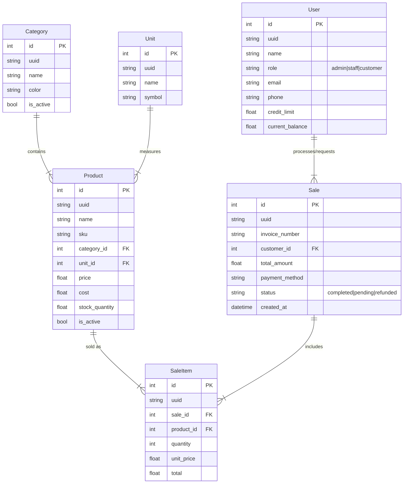

# Entity Architecture

This document defines the data model for the Ezo POS system, including entity relationships and attribute definitions.

## 1. Entity Relationship Diagram (ERD)

## 2. Entity Definitions

### 2.1 Core Entities

#### **Product**
Represents a physical item available for sale.
*   **Attributes:**
    *   `id` (PK): Auto-incrementing internal ID.
    *   `uuid`: Unique identifier for sync/replication.
    *   `name`: Display name of the product.
    *   `sku`: Stock Keeping Unit, unique barcode/identifier.
    *   `category_id` (FK): Links to `Category`.
    *   `unit_id` (FK): Links to `Unit`.
    *   `price`: Selling price ($).
    *   `cost`: Purchase cost ($) for profit calculation.
    *   `stock_quantity`: Current inventory level.
    *   `is_active`: Soft delete flag.

#### **Category**
Groups products logically (e.g., Beverages, Snacks).
*   **Attributes:**
    *   `id` (PK): Internal ID.
    *   `name`: Category name.
    *   `color`: Hex color code for UI button styling.
    *   `is_active`: Soft delete flag.

#### **Unit**
Units of measurement (e.g., kg, pcs, ltr).
*   **Attributes:**
    *   `id` (PK): Internal ID.
    *   `name`: Full name (Kilogram).
    *   `symbol`: Short code (kg).

### 2.2 Transaction Entities

#### **Sale**
Represents a completed transaction or order.
*   **Attributes:**
    *   `id` (PK): Internal ID.
    *   `invoice_number`: Human-readable receipt number.
    *   `customer_id` (FK): Optional link to a Customer (`User` entity).
    *   `subtotal`: Sum of items before tax/discount.
    *   `tax`: Tax amount.
    *   `discount`: Global discount amount.
    *   `total`: Final payable amount.
    *   `payment_method`: 'Card', 'Cash', 'Online'.
    *   `status`: Transaction state.
    *   `created_at`: Timestamp of sale.

#### **SaleItem**
An individual line item within a sale.
*   **Attributes:**
    *   `id` (PK): Internal ID.
    *   `sale_id` (FK): Parent Sale.
    *   `product_id` (FK): Product sold.
    *   `quantity`: Amount sold.
    *   `unit_price`: Price at the time of sale (snapshots product price).
    *   `total`: `quantity * unit_price` (minus item discount).

### 2.3 Actor Entities

#### **User**
Unified entity for System Users (Admin/Staff) and Customers.
*   **Attributes:**
    *   `id` (PK): Internal ID.
    *   `name`: Full name.
    *   `role`: Discriminator field.
        *   `admin`: Full access.
        *   `staff`: POS access.
        *   `customer`: Loyalty/CRM tracking only.
    *   `email/phone`: Contact info.
    *   `credit_limit`: Max allowed debt (for post-paid customers).
    *   `current_balance`: Outstanding debt.

### 2.4 Sync & Common Fields
All entities typically include these for synchronization capability:
*   `uuid`: Globally unique ID.
*   `created_at`: Creation timestamp.
*   `updated_at`: Last modification timestamp.
*   `sync_status`: `synced` | `pending` | `error`.
