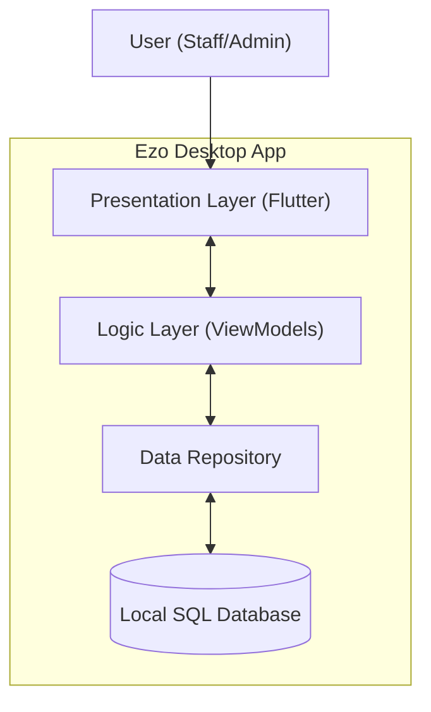

# High-Level Design (HLD)
## Ezo POS System

**Version:** 1.0  
**Date:** 2025-12-26  
**Status:** Draft

---

## 1. Introduction
This High-Level Design (HLD) document provides the architectural overview of the Ezo POS system. It outlines the system's decomposition into subsystems, the communication between them, and the technology choices made to meet the requirements specified in the SRS.

## 2. System Architecture

### 2.1 Architectural Pattern
The application follows the **MVVM (Model-View-ViewModel)** architectural pattern combined with a **Repository Pattern** for data abstraction.

*   **View (UI):** Flutter Widgets responsible for rendering the interface and handling user interactions.
*   **ViewModel:** Contains presentation logic and state management. It communicates with the UI via reactive state (using `Stream` or `notifyListeners`) and interacts with the domain/data layer.
*   **Repository:** Facade for data access. It decides whether to fetch data from the local database or (in future) a remote server.
*   **Model:** Plain Dart Objects (PDOs) representing the domain entities.

### 2.2 System Context Diagram
The following diagram illustrates the interaction between the Ezo POS system and external entities (Users).

```mermaid
contextDiagram
    Actor Staff
    Actor Admin
    System EzoPOS ["Ezo POS System"]
    
    Staff --> EzoPOS : "Process Sales, View Stock"
    Admin --> EzoPOS : "Manage Users, Reports, Inventory"
```

### 2.3 Container Diagram
Since Ezo is currently a standalone desktop application, the container diagram focuses on its internal logical containers.



---

## 3. Technology Stack

| Component | Technology | Rationale |
| :--- | :--- | :--- |
| **Frontend Framework** | Flutter (Dart) | Cross-platform (Linux/Windows), high performance, native-like UI. |
| **State Management** | Provider / Riverpod | Efficient state propagation and dependency injection support. |
| **Database** | Drift (SQLite) | Type-safe SQL wrapper, excellent offline performance, reactive streams. |
| **Routing** | GoRouter | Declarative routing, deep linking support, easy nested navigation (ShellRoute). |
| **Dependency Injection** | Manual / ServiceLocator | Simple, explicit dependency management custom implementation. |

---

## 4. Component Design

### 4.1 Dependency Injection
The system uses a `ServiceLocator` (Singleton) pattern to manage dependencies. `AppDatabase` is instantiated once and injected into Repositories. Repositories are injected into ViewModels.

### 4.2 Routing Strategy
The app uses `GoRouter` with `StatefulShellRoute` to maintain the state of the bottom navigation/sidebar tabs (Dashboard, Inventory, POS, etc.).
*   **/dashboard:** Home screen.
*   **/inventory:** Nested routes for Product List, Product Details, Add Product.
*   **/pos:** Fullscreen route (outside shell) for distraction-free sales operation.

### 4.3 Database Strategy
*   **Local First:** All data is stored locally in `sqlite3`.
*   **Reactive:** The app utilizes Drift's `watch()` methods to automatically update the UI when database content changes.
*   **Migrations:** Drift manages schema versions and migrations.

---

## 5. Security & Reliability
*   **Data Persistence:** SQLite Write-Ahead Logging (WAL) is enabled for concurrency and data safety.
*   **Offline Mode:** The architecture is inherently offline-first; no network calls are required for core POS operations.
*   **Error Handling:** Local logging for unexpected crashes.

