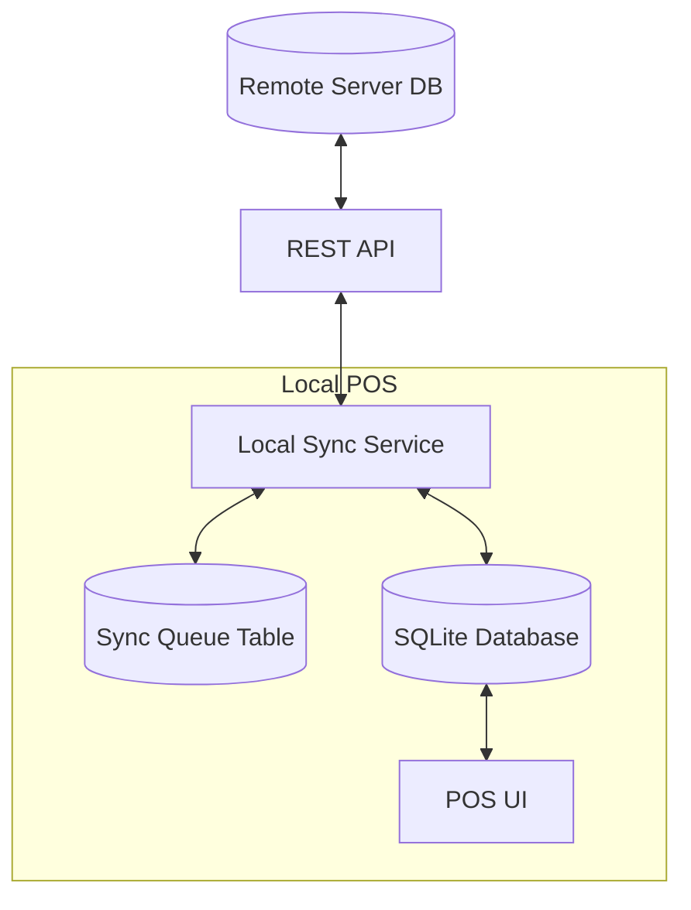

# Ingestion Pipeline & Data Sync Architecture

This document defines the strategy for synchronizing data between the local Ezo POS (Offline-First) and the Remote Server (Cloud).

## 1. High-Level Architecture

The system follows a **Hub-and-Spoke** model where the Cloud Server is the source of truth for Master Data (Products, Prices), and the Local POS is the source of truth for Transaction Data (Sales).



## 2. Synchronization Strategies

### 2.1 Downstream Sync (Pull)
**Goal:** Fetch updates for Products, Categories, and Customers from Cloud to Local.
*   **Trigger:** App Start, Manual "Sync" Button, Periodic Background Timer (every 15 mins).
*   **Mechanism:** "Delta Sync" using timestamps.
*   **Logic:**
    1.  `GET /api/v1/sync/downstream?last_synced_at=2024-01-01T10:00:00Z`
    2.  Server returns all records modified *after* that timestamp.
    3.  Local DB upserts records based on `uuid`.

### 2.2 Upstream Sync (Push)
**Goal:** Upload offline Sales and Inventory Adjustments to Cloud.
*   **Trigger:** Immediate (if online), or via Queue Processor (if offline).
*   **Mechanism:** Queue-based processing.
*   **Logic:**
    1.  User completes Sale.
    2.  Sale saved to `Sales` table.
    3.  Job added to `SyncQueue` table (Pending).
    4.  SyncService processes Queue:
        *   `POST /api/v1/sync/upstream` with payload.
        *   On 200 OK: Mark Queue Item as `Completed`.
        *   On Fail: Mark as `Retry`, increase retry count.

## 3. Offline Handling (The Sync Queue)

To guarantee eventual consistency, all mutating actions go through a persistent queue.

**Table: `sync_queue`**
| Column | Type | Description |
| :--- | :--- | :--- |
| `id` | Integer | PK |
| `entity_type` | String | 'Sale', 'Product', 'Adjustment' |
| `entity_id` | Integer | ID of the local record |
| `action` | String | 'CREATE', 'UPDATE', 'DELETE' |
| `payload` | String (JSON) | Serialized data to send |
| `status` | Integer | 0: Pending, 1: Success, 2: Failed |
| `retry_count` | Integer | Number of attempts (Max 5) |
| `created_at` | DateTime | When the action occurred |

## 4. API Data Contracts

### 4.1 Bulk Ingestion (Common Format)
To reduce network chatter, data is exchanged in batches.

**Request/Response Structure:**
```json
{
  "sync_id": "req_12345",
  "timestamp": "2024-01-01T12:00:00Z",
  "changes": {
    "products": [
      {
        "uuid": "prod_001",
        "name": "Coffee",
        "price": 5.00,
        "updated_at": "..."
      }
    ],
    "categories": [],
    "sales": []
  }
}
```

## 5. Conflict Resolution
*   **Last Write Wins (LWW):** For simple fields like Product Name.
*   **Server Authority:** If a Product Price changes locally and remotely, Server wins.
*   **Immutable Sales:** Sales cannot be edited after creation, preventing conflicts.
