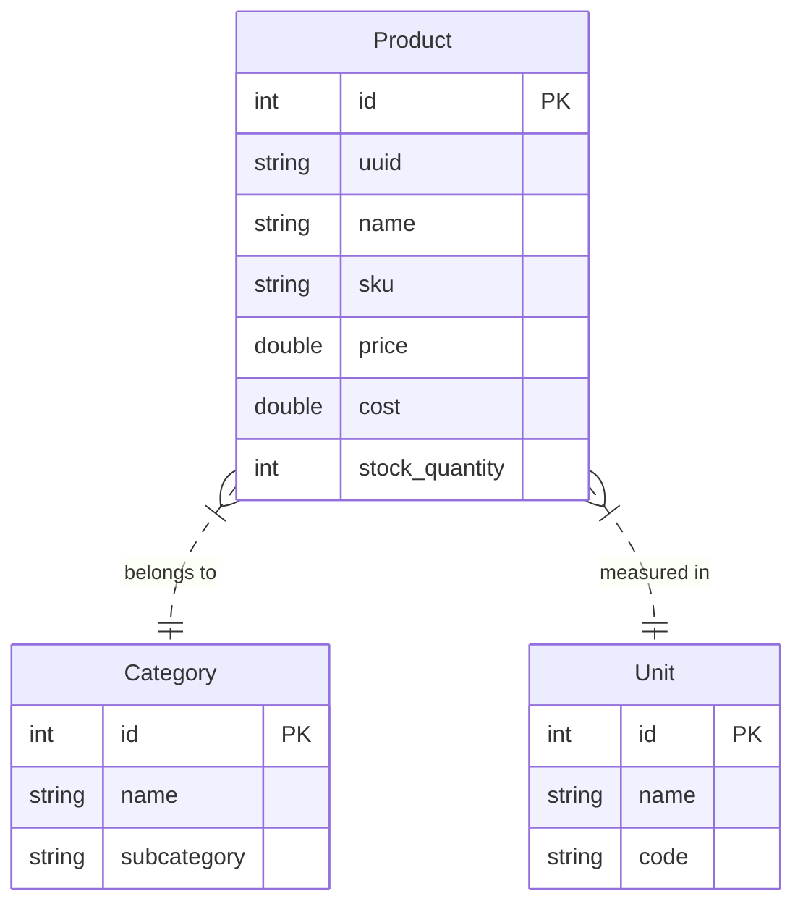
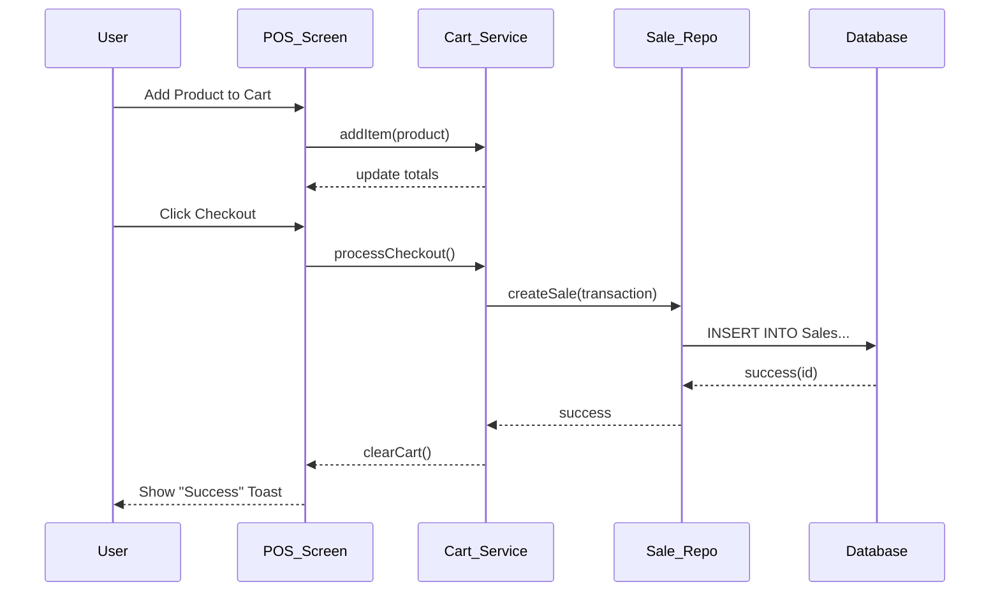

# Low-Level Design (LLD)
## Ezo POS System

**Version:** 1.0  
**Date:** 2025-12-26  
**Status:** Draft

---

## 1. Introduction
This Low-Level Design (LLD) document details the internal logic, database schema, and object interactions of the Ezo POS system. It serves as a blueprint for developers to implement and maintain the system.

## 2. Database Schema Design
The application uses **SQLite** (via Drift) for local data storage.

### 2.1 Entity Relationship Diagram (ERD)

### 2.2 Table Definitions

#### Products Table
| Column | Data Type | Constraints | Description |
| :--- | :--- | :--- | :--- |
| `id` | `INTEGER` | `PRIMARY KEY AUTOINCREMENT` | Internal ID |
| `uuid` | `TEXT` | `NOT NULL UNIQUE` | Global ID for sync |
| `name` | `TEXT` | `NOT NULL` | Product Name |
| `sku` | `TEXT` | `NOT NULL` | Stock Keeping Unit |
| `category_id` | `INTEGER` | `ForeignKey(Categories)` | Link to Category |
| `unit_id` | `INTEGER` | `ForeignKey(Units)` | Link to Unit |
| `price` | `REAL` | `NOT NULL` | Selling Price |
| `cost` | `REAL` | `DEFAULT 0` | Cost Price |
| `stock_quantity` | `INTEGER` | `DEFAULT 0` | Current Stock |
| `is_active` | `BOOLEAN` | `DEFAULT TRUE` | Soft Delete flag |

#### Categories Table
| Column | Data Type | Constraints | Description |
| :--- | :--- | :--- | :--- |
| `id` | `INTEGER` | `PRIMARY KEY AUTOINCREMENT` | Internal ID |
| `uuid` | `TEXT` | `NOT NULL` | Global ID |
| `name` | `TEXT` | `NOT NULL` | Category Name |
| `subcategory` | `TEXT` | `NULLABLE` | Optional Subcategory |
| `description` | `TEXT` | `NULLABLE` | Description |

---

## 3. Class Design

### 3.1 Core Models
Models are immutable Dart classes with `fromJson` / `toJson` for serialization.

**Class: Product**
*   `int id`
*   `String uuid`
*   `String name`
*   `copyWith(...)` -> Returns new instance with updated fields.

**Class: Category**
*   `int id`
*   `String name`
*   `bool isActive`

### 3.2 Repositories
Repositories abstract the `Drift` database calls.

**Class: ProductRepository**
*   `getAllProducts(): Future<List<Product>>`
*   `watchAllProducts(): Stream<List<Product>>`
*   `createProduct(Product): Future<int>`
*   `updateProduct(Product): Future<bool>`
*   `deleteProduct(int): Future<int>`

**Class: CategoryRepository**
*   `getAllCategories(): Future<List<Category>>`
*   `watchAllCategories(): Stream<List<Category>>`
*   `createCategory(Category): Future<int>`

---

## 4. Sequence Diagrams

### 4.1 Process Sale Flow
Sequence of events when a cashier processes a sale.

---

## 5. Application Logic

### 5.1 startup Logic (`main.dart`)
1.  `WidgetsFlutterBinding.ensureInitialized()`
2.  `ServiceLocator.initialize()` -> Await DB and Repos.
3.  `runApp(EzoApp)`

### 5.2 Dependency Injection
*   **ServiceLocator:** A singleton class `ServiceLocator.instance`.
*   **Usage:** `final productRepo = ServiceLocator.instance.productRepository;`

### 5.3 State Management (ViewModel)
*   **CategoryViewModel:**
    *   Holds `AsyncValue<List<Category>>`
    *   Methods: `loadCategories()`, `addCategory()`.
    *   Notifies listeners on DB changes via Stream subscription.

