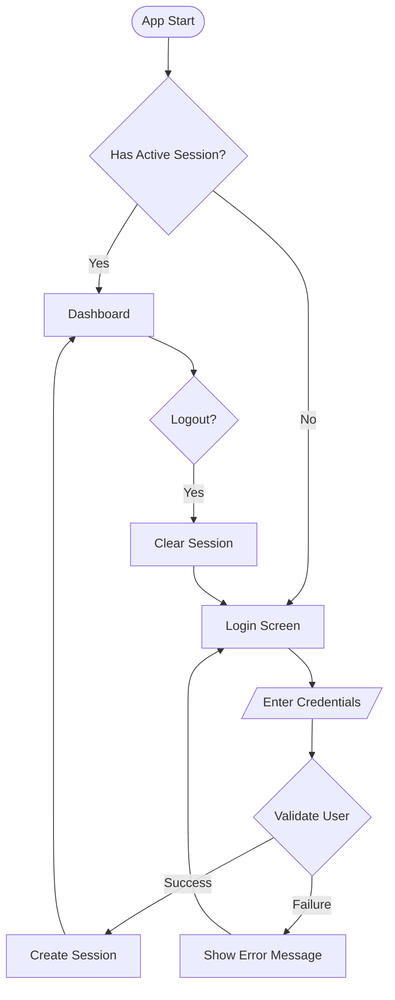
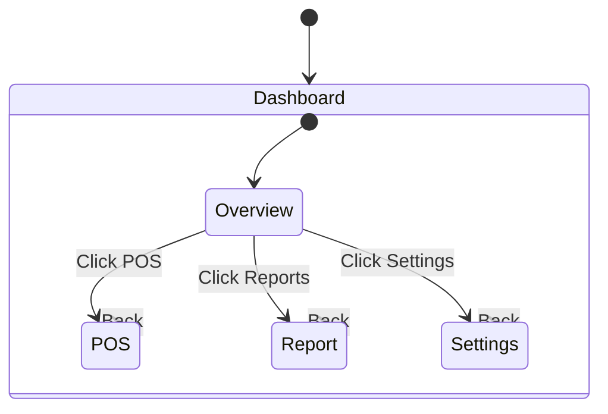
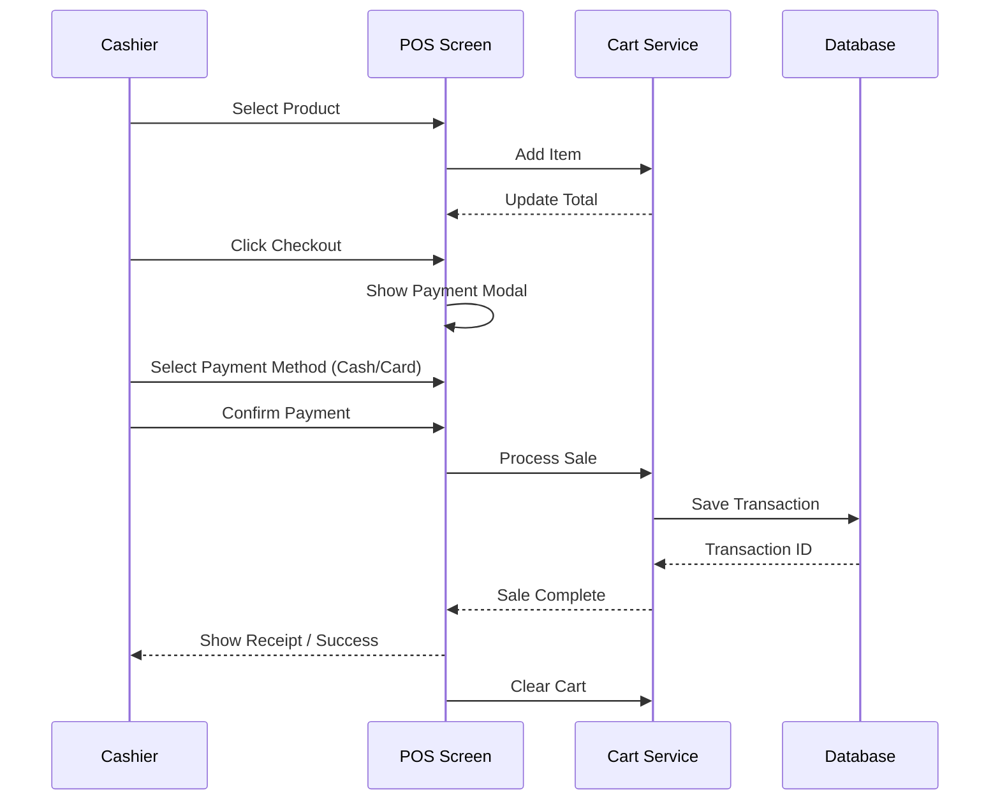
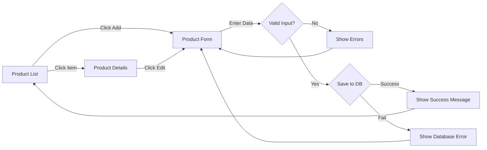
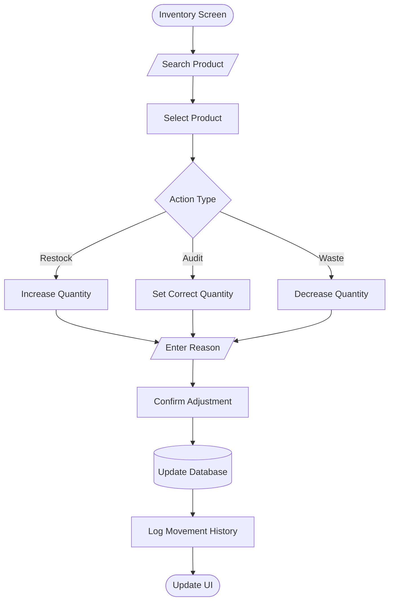

# User Flow Architecture

This document outlines the core user flows for the Ezo POS system, visualized using Mermaid diagrams.

## 1. Authentication Flow
Handles user login, session validation, and logout.

## 2. Dashboard Navigation
High-level navigation between main modules.

## 3. POS Transaction Flow
The primary workflow for Cashiers processing a sale.

## 4. Product Management (Admin)
Flow for adding or editing inventory items.

## 5. Inventory Adjustment
Flow for manually updating stock levels.

